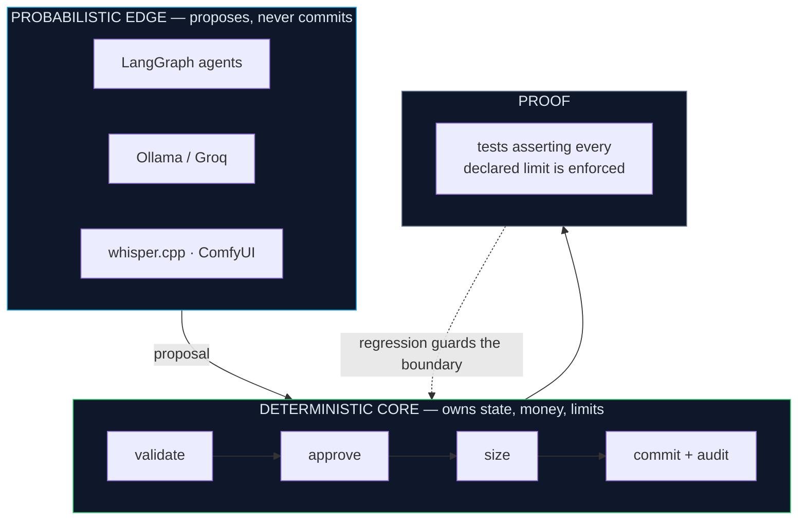
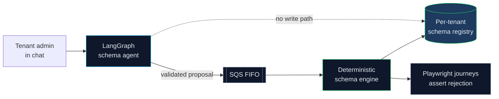

# README design previews

Ten directions for `sathwikbairaboina2/sathwikbairaboina2`. Each block below renders exactly as it would on the profile — same widgets, same real numbers. Pick one (or mix sections across two) and it gets built out in full on `main`.

Constraints baked into all ten:

- The name is **never** inside a `capsule-render` banner — that service force-injects a `fadeIn` animation, so banner text renders blank in screenshots and link previews.
- No `github-readme-stats` (503), no `github-profile-trophy` (402), no contribution graph — the profile is private and the real work is in private repos. Counts are static shields with real numbers from the workshop atlas.

| # | Direction | One-line pitch | Best if you want |
|---|---|---|---|
| [1](#1--terminal) | Terminal | The profile is a shell session | Engineer-to-engineer signal |
| [2](#2--blueprint) | Blueprint | One schematic carries the whole thesis | The idea to land in 5 seconds |
| [3](#3--spec-sheet) | Spec sheet | Datasheet, not a poster | Recruiters who skim tables |
| [4](#4--editorial) | Editorial | Pull-quote and whitespace | To read as a writer, not a widget |
| [5](#5--status-board) | Status board | Live-ops HUD over ten systems | To look operational |
| [6](#6--case-study-first) | Case-study first | One system told properly, rest as appendix | Depth over breadth |
| [7](#7--monochrome) | Monochrome | Zero images, pure text | Instant load, perfect on mobile |
| [8](#8--timeline) | Timeline | Career and workshop on one spine | Eight years to read as a narrative |
| [9](#9--mermaid) | Mermaid | Native GitHub architecture diagram | To show system design, not list it |
| [10](#10--metrics-desk) | Metrics desk | Numbers-forward, bar-charted | Scale to hit first |

---

## 1 · Terminal

<div align="center">

```console
$ whoami
sathwik — senior full stack engineer · ai workflow architect · 8 yrs

$ cat thesis.txt
The model proposes. The core disposes.

$ ls ~/workshop
marketplace/  Avatara/   RakshaQuant/       PersonalAITutor/  ComicGen/
Invisible/    IntaBot/   personalAssistant/ AeoGeo/           instascraper/

$ devkit test-all --full
10 systems · 9 cold-bootable · 2,875 tests · ~160k lines · 1,080 commits
```

</div>

<div align="center">

[](https://linkedin.com/in/sathwik-bairaboina-630433182/)
[](mailto:bairaboinasathwik@gmail.com)
[](https://www.aiavatara.chat/about)
[](https://youtu.be/5753AhC2ysw)

</div>

```console
$ head -8 ~/workshop/marketplace/README.md

  marketplace — multi-tenant commerce + schema agent
  "A chat that safely rewrites your database schema."

  37.9k lines · 489 files · 293 commits
  NestJS ×2 · Next.js · LangGraph.js · LocalStack · Playwright

  The agent never writes to the registry. It emits proposals
  the engine adjudicates.
```

<sub><b>Why it works:</b> every project card becomes a <code>head</code> of its own README, so the whole page has one consistent grammar. <b>Risk:</b> ten console fences in a row gets monotonous — the work-experience section has to break out into normal prose.</sub>

---

## 2 · Blueprint

<div align="center">

# Sathwik Bairaboina

**Senior Full Stack Engineer** · **AI Workflow Architect**

</div>

```
        ┌───────────────────────── PROBABILISTIC EDGE ─────────────────────────┐
        │                                                                      │
        │   LangGraph agents  ·  Ollama  ·  Groq  ·  whisper.cpp  ·  ComfyUI    │
        │                                                                      │
        │   classifies · drafts · proposes · ranks · summarises                 │
        └──────────────────────────────┬───────────────────────────────────────┘
                                       │
                             proposals only — never writes
                                       │
                                       ▼
        ╔══════════════════════════ DETERMINISTIC CORE ════════════════════════╗
        ║                                                                      ║
        ║   owns:  state · money · limits · schema · identity                   ║
        ║   does:  validate → approve → size → commit → audit                   ║
        ║                                                                      ║
        ╚══════════════════════════════╤═══════════════════════════════════════╝
                                       │
                                       ▼
                     ┌─────────────────────────────────────┐
                     │  tests asserting every declared     │
                     │  limit is actually enforced         │
                     └─────────────────────────────────────┘
```

<div align="center">
<sub>Every one of the ten systems below is this diagram, instantiated.</sub>
</div>

| System | What the model proposes | What the core refuses to delegate |
|---|---|---|
| **RakshaQuant** | market regime, strategy, signal | approval, position sizing, risk limits |
| **marketplace** | a schema change, in conversation | the per-tenant schema registry itself |
| **PersonalAITutor** | next task, difficulty, feedback | mastery — replayed from the attempt log |
| **IntaBot** | caption text, next free slot | the publish state machine, human approval |
| **personalAssistant** | voice-driven edits, summaries | every action also has a manual path |

<sub><b>Why it works:</b> the one thing you actually want remembered is on screen before any badge. <b>Risk:</b> box-drawing needs a monospace fence, which GitHub renders narrow on mobile.</sub>

---

## 3 · Spec sheet

<div align="center">

# SATHWIK BAIRABOINA

`senior full stack engineer` · `ai workflow architect`

[linkedin](https://linkedin.com/in/sathwik-bairaboina-630433182/) · [email](mailto:bairaboinasathwik@gmail.com) · [portfolio](https://www.aiavatara.chat/about) · [demo](https://youtu.be/5753AhC2ysw)

</div>

### Summary

| | |
|---|---|
| **Experience** | 8+ years · 5 companies · currently co-founding Lego Verse Module |
| **Thesis** | Deterministic core owns state, money and limits. Probabilistic layer proposes. |
| **Workshop** | 10 systems · 9 cold-bootable in one command · 2,875 tests |
| **Volume** | ~160k lines · 1,080 commits · local-first, no API bills |
| **Open to** | Senior / staff, AI platform engineering |

### Systems

| System | Domain | Lines | Commits | Stack | Repo |
|---|---|--:|--:|---|:-:|
| [marketplace](https://github.com/sathwikbairaboina2/marketplace) | Multi-tenant commerce + schema agent | 37.9k | 293 | NestJS ×2 · Next.js · LangGraph.js | private |
| [Avatara](https://github.com/sathwikbairaboina2/Avatara) | Character chat platform | 34.1k | 277 | NestJS ×2 · LangGraph · Ollama | private |
| [RakshaQuant](https://github.com/sathwikbairaboina2/RakshaQuant) | Agentic NSE paper trading | 25.1k | 112 | Python · LangGraph · Groq | private |
| [PersonalAITutor](https://github.com/sathwikbairaboina2/PersonalAITutor) | Mastery-tracking tutor | 15.5k | 89 | NestJS ×2 · DynamoDB · mathjs | private |
| [ComicGen](https://github.com/sathwikbairaboina2/ComicGen) | Local comic studio | 14.4k | 110 | FastAPI · ComfyUI/FLUX · Ollama | **public** |
| [IntaBot](https://github.com/sathwikbairaboina2/IntaBot) | Agentic Instagram ops | 9.0k | 51 | NestJS · BullMQ · MinIO | private |
| [Invisible](https://github.com/sathwikbairaboina2/Invisible) | Capture-excluded overlay | 8.7k | 74 | Electron 43 · whisper.cpp · Qdrant | **public** |
| [personalAssistant](https://github.com/sathwikbairaboina2/personalAssistant) | Local-first life tracker | 8.1k | 45 | NestJS · faster-whisper · kokoro | private |
| [AeoGeo](https://github.com/sathwikbairaboina2/AeoGeo) | AI-search visibility scanner | 7.7k | 29 | NestJS · Turborepo · DynamoDB | private |
| [instascraper](https://github.com/sathwikbairaboina2/instascraper) | Serialized media fetcher | — | — | Next.js · FastAPI · Instaloader | private |

### Experience

| Period | Company | Role | Headline |
|---|---|---|---|
| `AUG 2023 —` | **Lego Verse Module** | Sr. Full Stack · Co-Founder | AI SaaS on AWS · 50% faster deploys · 99.99% uptime |
| `2022 — 2023` | **Epilot GmbH** 🇩🇪 | Full Stack Engineer | JSON-schema entity import/export · 30% faster loads |
| `2021 — 2022` | **Aithinkers** | Sr. Software Developer | Real-time pricing engine on Lambda + Elasticsearch |
| `2017 — 2021` | **Iolar Technologies** | Full Stack Engineer | On-demand vehicle maintenance, MERN + React Native |
| `2017` | **CMAE Technologies** | Sr. Full Stack Engineer | IoT car platform over MQTT and CAN-BUS |

<sub><b>Why it works:</b> a recruiter gets everything in three scrolls with zero decoding. <b>Risk:</b> reads corporate — none of the personality of the current page survives.</sub>

---

## 4 · Editorial

<div align="center">

<br/>

# Sathwik Bairaboina

<br/>

### *"Where is the model allowed to make a decision,*

### *and where is it absolutely not?"*

<br/>

<sub>S E N I O R &nbsp; F U L L &nbsp; S T A C K &nbsp; E N G I N E E R &nbsp;&nbsp;·&nbsp;&nbsp; A I &nbsp; W O R K F L O W &nbsp; A R C H I T E C T</sub>

<br/>

</div>


I have been writing software for eight years, and I have converged on one line in a system design that I care about more than any other: the boundary.

Almost everything I ship has the same skeleton. A deterministic core that owns state, money and limits. A probabilistic layer wrapped around it that *proposes* rather than executes. Then a test asserting that every declared limit is actually enforced. That last part is where most agentic systems quietly fail — the boundary is documented, not defended.

Lately that thesis lives in a workshop of ten local-first systems running on my own hardware. Trading agents, tutors, comic pipelines, meeting overlays. No API bills, no telemetry, nothing phoning home. Nine of them cold-boot with a single command, because a system you cannot start from zero is a system you cannot honestly claim to have finished.


<div align="center">

### I. &nbsp; The one that proves the point

</div>

**RakshaQuant** — *let the model read the market, never let it place the order.*

A LangGraph pipeline of Groq-backed agents classifies market regime, picks strategies and validates signals. Then it stops. A deterministic rules engine does final approval, position sizing and limit enforcement. Hardened to v2.1 against a nine-defect audit. Paper-only by default, and the default is the point.

<sub><code>Python 3.11</code> · <code>LangGraph</code> · <code>Groq</code> · <code>LangSmith</code> · <code>uv</code> — 25.1k lines, 112 commits</sub>

<sub><b>Why it works:</b> it reads like a person wrote it, which is rare on GitHub. <b>Risk:</b> long-form loses skimmers; needs the spec table from #3 pinned at the bottom.</sub>

---

## 5 · Status board

<div align="center">

# `sathwik@workshop`

<sub>SENIOR FULL STACK ENGINEER · AI WORKFLOW ARCHITECT · 8+ YEARS</sub>


</div>

```
  SYSTEM              DOMAIN                        TESTS   BOOT    LLM ROLE
  ───────────────────────────────────────────────────────────────────────────────
  ● marketplace       multi-tenant commerce          545    1 cmd   proposes schema
  ● Avatara           character chat                 554    1 cmd   generates persona
  ● RakshaQuant       NSE paper trading              364    1 cmd   reads market only
  ● PersonalAITutor   mastery tutor                  560    1 cmd   drafts tasks
  ● ComicGen          local comic studio             323    1 cmd   writes script
  ● Invisible         capture-excluded overlay       123    1 cmd   advises live
  ● IntaBot           instagram operations           167    1 cmd   drafts captions
  ● personalAssistant local-first tracker              —    1 cmd   accelerator only
  ● AeoGeo            ai-search visibility           316    1 cmd   scores citability
  ○ instascraper      serialized fetcher               —    1 cmd   none
  ───────────────────────────────────────────────────────────────────────────────
  ● cold-boot verified     ○ runs, no test harness          snapshot: 2026-09-05
```

<div align="center">

**`_devkit`** — one command per stack. Cold boot, health verify, run the tests. Some need 3–6 containers, a seed step and a signed JWT before the first real assertion.

</div>

<sub><b>Why it works:</b> the fixed-width board makes ten private repos feel like infrastructure you actually operate. <b>Risk:</b> the dots imply live monitoring — the dated caption is what keeps it honest.</sub>

---

## 6 · Case-study first

<div align="center">

# Sathwik Bairaboina

<sub>Senior Full Stack Engineer · AI Workflow Architect · 8+ years</sub>

</div>


## The problem I keep solving

An LLM is excellent at proposing and terrible at being trusted. Every agentic system I have built or reviewed fails in the same place: the model is handed a write.

## How I solve it — worked example: `marketplace`

<sub>37.9k lines · 489 files · 293 commits · NestJS ×2 · Next.js · LangGraph.js · LocalStack · Playwright</sub>

A multi-tenant commerce platform where each tenant defines its own entity schema, and a chat interface lets a non-engineer change that schema in conversation.

**Constraint.** The schema registry is the system of record. A hallucinated column drops customer data. So the agent gets no write path at all.

**Shape.** Two services, decoupled by an SQS FIFO queue. The deterministic engine owns the per-tenant registry and adjudicates every change. The LangGraph layer turns a conversation into a *validated proposal* and emits it onto the queue. FIFO because schema changes must apply in the order a human agreed to them.

**Proof.** Playwright journeys assert that a proposal the engine rejects never lands, and that a malformed proposal cannot even be enqueued. The boundary is a test, not a comment.

<div align="center">
<sub>The same shape, nine more times ↓</sub>
</div>

| | | |
|---|---|---|
| [**Avatara**](https://github.com/sathwikbairaboina2/Avatara)<br/><sub>character chat · 34.1k</sub> | [**RakshaQuant**](https://github.com/sathwikbairaboina2/RakshaQuant)<br/><sub>paper trading · 25.1k</sub> | [**PersonalAITutor**](https://github.com/sathwikbairaboina2/PersonalAITutor)<br/><sub>mastery tutor · 15.5k</sub> |
| [**ComicGen**](https://github.com/sathwikbairaboina2/ComicGen)<br/><sub>comic studio · 14.4k</sub> | [**IntaBot**](https://github.com/sathwikbairaboina2/IntaBot)<br/><sub>instagram ops · 9.0k</sub> | [**Invisible**](https://github.com/sathwikbairaboina2/Invisible)<br/><sub>meeting overlay · 8.7k</sub> |
| [**personalAssistant**](https://github.com/sathwikbairaboina2/personalAssistant)<br/><sub>life tracker · 8.1k</sub> | [**AeoGeo**](https://github.com/sathwikbairaboina2/AeoGeo)<br/><sub>ai-search scanner · 7.7k</sub> | [**instascraper**](https://github.com/sathwikbairaboina2/instascraper)<br/><sub>media fetcher</sub> |

<sub><b>Why it works:</b> one system explained at depth proves more than ten explained at badge-length. <b>Risk:</b> the other nine get demoted to a grid — fine only if marketplace is genuinely the flagship.</sub>

---

## 7 · Monochrome

<div align="center">

**SATHWIK BAIRABOINA**

Senior Full Stack Engineer · AI Workflow Architect · 8+ years

[LinkedIn](https://linkedin.com/in/sathwik-bairaboina-630433182/) · [Email](mailto:bairaboinasathwik@gmail.com) · [Portfolio](https://www.aiavatara.chat/about) · [Demo](https://youtu.be/5753AhC2ysw)

</div>

---

**The model proposes. The core disposes.**

Deterministic core owns state, money and limits. Probabilistic layer proposes rather than executes. A test asserts every declared limit is actually enforced.

Ten local-first AI systems on my own hardware — nine cold-boot in one command. ~160k lines · 1,080 commits · 2,875 tests · no API bills, no telemetry.

---

**Workshop**

- **marketplace** — multi-tenant commerce; a chat that safely rewrites your database schema. `37.9k`
- **Avatara** — character.ai, rebuilt to run on your own box. `34.1k`
- **RakshaQuant** — the model reads the market; a rules engine places the order. `25.1k`
- **PersonalAITutor** — mastery that decays, replayed from the attempt log. `15.5k`
- **ComicGen** — topic in, finished comic page out, entirely local. `14.4k`
- **IntaBot** — draft, schedule, approve, publish, as a state machine. `9.0k`
- **Invisible** — meeting overlay excluded from screen capture, ~673 ms to first word. `8.7k`
- **personalAssistant** — works perfectly with the AI stack switched off. `8.1k`
- **AeoGeo** — SEO is solved; being cited by an LLM is not. `7.7k`
- **instascraper** — rate limiting as an architecture, not a config value.

---

**Experience** — Lego Verse Module *(co-founder, current)* · Epilot GmbH 🇩🇪 · Aithinkers · Iolar Technologies · CMAE Technologies

**Stack** — TypeScript · Python · Go · NestJS · Next.js · React · FastAPI · LangGraph · Ollama · AWS · Docker · Kubernetes · DynamoDB · Postgres · Redis · Elasticsearch

---

<sub><b>Why it works:</b> loads instantly and never breaks when a badge service 503s — which has already happened twice on this profile. Best mobile read of the ten. <b>Risk:</b> no visual hook at all; it lives or dies on the writing.</sub>

---

## 8 · Timeline

<div align="center">

# Sathwik Bairaboina

<sub>Eight years, in order.</sub>

</div>

```
2017  ●  CMAE Technologies — Senior Full Stack Engineer
      │  IoT car platform. MQTT + CAN-BUS on AWS, ECU parsing on Raspberry Pi,
      │  geofencing for theft prevention. Software ↔ hardware, concept to prototype.
      │
2017  ●  Iolar Technologies — Full Stack Engineer
 —    │  On-demand vehicle maintenance. MERN + React Native, real-time booking
2021  │  and tracking. Recruited and mentored the engineering team.
      │
2021  ●  Aithinkers — Senior Software Developer
 —    │  AeroPartsNow front-end rebuild. Real-time dynamic pricing on Lambda,
2022  │  DynamoDB and Elasticsearch. AppSync GraphQL. Set the team standards.
      │
2022  ●  Epilot GmbH 🇩🇪 — Full Stack Engineer
 —    │  JSON-schema import/export for dynamic tenant entities. Storybook component
2023  │  library — 95% of UI bugs caught pre-release. 30% faster load times.
      │
2023  ●  Lego Verse Module — Senior Full Stack Engineer · Co-Founder
 —    │  AI-driven SaaS on AWS. LangChain + Hugging Face inference, ECS auto-scaling,
 now  │  GraphQL, CDK CI/CD. 50% faster deploys, 99.99% uptime.
      │
      ├──●  and, in parallel, the workshop
      │
      │     marketplace · Avatara · RakshaQuant · PersonalAITutor · ComicGen
      │     Invisible · IntaBot · personalAssistant · AeoGeo · instascraper
      │
      ▼     10 systems · 9 cold-bootable · 2,875 tests · ~160k lines
```

<sub><b>Why it works:</b> eight years reads as a trajectory instead of a stack of cards, and the workshop lands as <i>what he does when nobody assigns it</i>. <b>Risk:</b> the employment dates need one last check before this goes on a public profile.</sub>

---

## 9 · Mermaid

<div align="center">

# Sathwik Bairaboina

<sub>Senior Full Stack Engineer · AI Workflow Architect</sub>

**The model proposes. The core disposes.**

</div>



<div align="center"><sub>Instantiated in <b>marketplace</b> — the flagship</sub></div>



<sub><b>Why it works:</b> GitHub renders mermaid natively — no third-party service to 503, and it is the only variant that <i>shows</i> system design instead of asserting it. <b>Risk:</b> mermaid theming is limited and diagrams render small on mobile; keep to two, never ten.</sub>

---

## 10 · Metrics desk

<div align="center">

# SATHWIK BAIRABOINA

<sub>SENIOR FULL STACK ENGINEER · AI WORKFLOW ARCHITECT</sub>

<br/>

<table>
<tr>
<td align="center" width="16%"><h2>10</h2><sub>SYSTEMS</sub></td>
<td align="center" width="16%"><h2>~160k</h2><sub>LINES</sub></td>
<td align="center" width="16%"><h2>1,080</h2><sub>COMMITS</sub></td>
<td align="center" width="16%"><h2>2,875</h2><sub>TESTS</sub></td>
<td align="center" width="16%"><h2>9</h2><sub>COLD-BOOTABLE</sub></td>
<td align="center" width="16%"><h2>8+</h2><sub>YEARS</sub></td>
</tr>
</table>

</div>


```
  SIZE OF THE WORKSHOP                                        lines   commits

  marketplace        ████████████████████████████████████████  37.9k      293
  Avatara            ████████████████████████████████████      34.1k      277
  RakshaQuant        ██████████████████████████                25.1k      112
  PersonalAITutor    ████████████████                          15.5k       89
  ComicGen           ███████████████                           14.4k      110
  IntaBot            █████████                                  9.0k       51
  Invisible          █████████                                  8.7k       74
  personalAssistant  ████████                                   8.1k       45
  AeoGeo             ████████                                   7.7k       29
  instascraper       ██                                            —        —
```

```
  TESTS PER STACK — cold boot, health verify, full suite

  PersonalAITutor    ████████████████████████████████████████  560
  Avatara            ███████████████████████████████████████   554
  marketplace        ██████████████████████████████████████    545
  RakshaQuant        ██████████████████████████                364
  ComicGen           ███████████████████████                   323
  AeoGeo             ██████████████████████                    316
  IntaBot            ████████████                              167
  Invisible          █████████                                 123
```

<div align="center">
<sub>Every bar above is one command: <code>devkit test-all --full</code>.</sub>
</div>

<sub><b>Why it works:</b> scale is the first thing on screen, and block-character bars need no external service. <b>Risk:</b> numbers-first reads as bragging unless the thesis line lands immediately after — pair it with the #2 blueprint block.</sub>

---

<div align="center">
<sub>Ten directions. Say a number (or two, to mix) and it gets built out in full on <code>main</code>.</sub>
</div>
