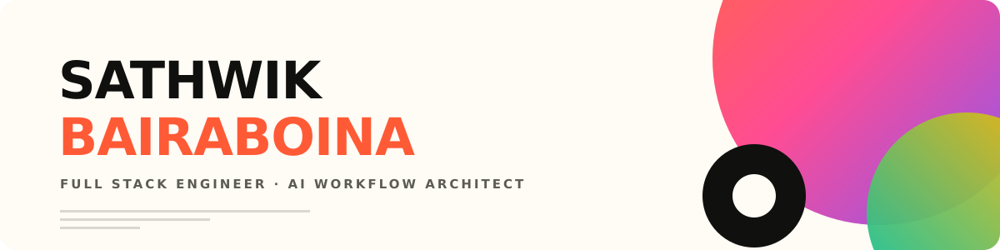
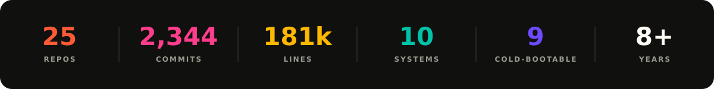
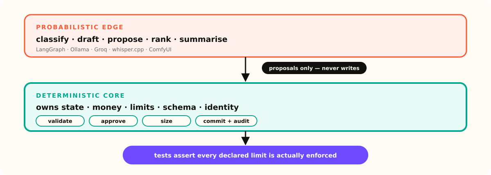
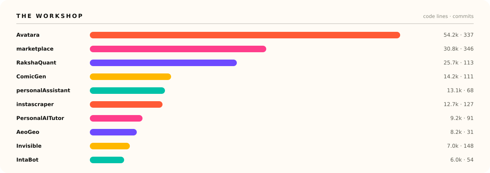

 

## The model proposes. The core disposes.

Every system I ship has the same skeleton — and it is the only thing on this page worth remembering.

 

## The workshop

Ten local-first AI systems on my own hardware. Nine cold-boot with one command. No API bills, no telemetry.

| | What it is | The line the model may not cross |
|---|---|---|
| [**Avatara**](https://github.com/sathwikbairaboina2/Avatara) | Character chat, rebuilt to run on your own box | It writes personas. It does not write the identity store. |
| [**marketplace**](https://github.com/sathwikbairaboina2/marketplace) | A chat that safely rewrites your database schema | It emits proposals over SQS FIFO. The engine adjudicates. |
| [**RakshaQuant**](https://github.com/sathwikbairaboina2/RakshaQuant) | Agentic NSE paper trading | It reads the market. A rules engine sizes and places. |
| [**ComicGen**](https://github.com/sathwikbairaboina2/ComicGen) ⬦ | Topic in, finished comic page out, fully local | It writes the script. Schema validation gates every panel. |
| [**personalAssistant**](https://github.com/sathwikbairaboina2/personalAssistant) | Local-first life tracker with voice | Every action has a manual path. AI is an accelerator. |
| [**instascraper**](https://github.com/sathwikbairaboina2/instascraper) | Serialized media fetcher | One worker thread. Rate limiting is structural, not config. |
| [**PersonalAITutor**](https://github.com/sathwikbairaboina2/PersonalAITutor) | Mastery-tracking tutor | Mastery replays from the attempt log. It cannot drift. |
| [**AeoGeo**](https://github.com/sathwikbairaboina2/AeoGeo) | AI-search visibility scanner | SEO is solved. Being cited by an LLM is not. |
| [**Invisible**](https://github.com/sathwikbairaboina2/Invisible) ⬦ | Meeting overlay excluded from screen capture | ~673 ms to first word. Audio never touches disk. |
| [**IntaBot**](https://github.com/sathwikbairaboina2/IntaBot) | Agentic Instagram operations | It drafts. A human approves. A state machine publishes. |

⬦ public · the rest are private, happy to walk anyone through them · plus [`_devkit`](https://github.com/sathwikbairaboina2/_devkit), the harness that cold-boots all nine

 

## Experience

| | | |
|---|---|---|
| `2023 —` | **Lego Verse Module** — Sr. Full Stack Engineer, Co-Founder | AI SaaS on AWS. LangChain + Hugging Face inference, ECS auto-scaling, CDK CI/CD. **50% faster deploys, 99.99% uptime.** |
| `2022 — 23` | **Epilot GmbH** 🇩🇪 — Full Stack Engineer | JSON-schema import/export for dynamic tenant entities. Storybook component library. **95% of UI bugs caught pre-release, 30% faster loads.** |
| `2021 — 22` | **Aithinkers** — Sr. Software Developer | AeroPartsNow rebuild. Real-time pricing engine on Lambda, DynamoDB, Elasticsearch. AppSync GraphQL. |
| `2017 — 21` | **Iolar Technologies** — Full Stack Engineer | On-demand vehicle maintenance, MERN + React Native. Recruited and mentored the team. |
| `2017` | **CMAE Technologies** — Sr. Full Stack Engineer | IoT car platform. MQTT + CAN-BUS on AWS, ECU parsing on Raspberry Pi, geofencing. |

 

### Open to senior and staff roles in AI platform engineering.

Especially where the hard part is the boundary between the model and the system of record.

 

